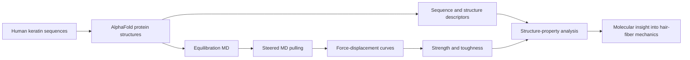

# Comparative Molecular Dynamics Characterization of Hair Keratin Unfolding Mechanics
This repository contains code, datasets, and representative media supporting our study of hair keratin proteins using molecular dynamics (MD) and steered molecular dynamics (SMD) simulations.

This work aims to investigate the secondary structure evolution, strain-rate-dependent unfolding behavior, and nanomechanical response of hair keratin proteins, and to provide reproducible simulation workflows and curated datasets for future studies on keratin mechanics and fibrous biomaterials.


## Contents
- Hair keratin protein dataset in CSV format, including protein properties and access links to corresponding FASTA and PDB files
- Simulation scripts for equilibration and steered molecular dynamics (SMD)
- Representative visualization media of protein unfolding simulations under different strain rates


## Repository structure
- `data/`: protein datasets and metadata
- `code/`: simulation scripts and workflow files
- `media/`: videos and visual materials

## Keratin Protein Background and Study Significance

Keratins are structural proteins that form intermediate filaments in epithelial tissues, including hair, skin, and nails. In hair fibers, keratin proteins assemble into hierarchical structures that help determine mechanical properties such as strength, elasticity, toughness, and resistance to fracture. Keratins are commonly grouped into two complementary classes: Type I keratins, which are generally acidic, and Type II keratins, which are generally basic or neutral. These proteins pair to form coiled-coil heterodimers that further assemble into larger filament networks.

This work focuses on human hair keratins at the molecular scale. While hair-fiber mechanics are often studied experimentally at the macroscopic level, the molecular unfolding behavior of individual keratin proteins is less systematically characterized. The paper addresses this gap by curating 51 human keratin proteins, predicting or collecting their structures, and simulating their unfolding under controlled steered molecular dynamics conditions.


The significance of this study is that it provides a reproducible, dataset-scale molecular dynamics framework for comparing keratin unfolding mechanics across Type I and Type II keratins. By connecting sequence features, predicted structures, secondary-structure descriptors, and MD-derived mechanical properties, the study helps explain how molecular-scale protein behavior may contribute to the toughness and resilience of hierarchical hair fibers.

The steered molecular dynamics pulling velocities used in the study are accelerated computational probes, not direct reproductions of experimental hair-fiber strain rates. Their value is comparative: they reveal relative unfolding trends, rate-sensitive stiffening, strength-toughness coupling, and relationships between molecular descriptors such as sequence length, molecular weight, coil content, SASA, and energy absorption.


## Keratin datasets

The keratin sequence, structure, and molecular-dynamics property datasets used in this work are available on Hugging Face under `lamm-mit`:

| Dataset | Contents |
|---|---|
| [`lamm-mit/keratin-fasta`](https://huggingface.co/datasets/lamm-mit/keratin-fasta) | 51 curated human keratin FASTA sequences with UniProt accessions, keratin type, organism metadata, sequence checksums, amino-acid composition, and molecular-weight descriptors. |
| [`lamm-mit/keratin-pdb`](https://huggingface.co/datasets/lamm-mit/keratin-pdb) | AlphaFold/AlphaFold2 PDB structures for the 51 keratins, including raw PDB text, chain/residue/atom metadata, SEQRES records, coordinate summaries, and pLDDT confidence statistics. |
| [`lamm-mit/keratin-mech-seq-ss-md-properties`](https://huggingface.co/datasets/lamm-mit/keratin-mech-seq-ss-md-properties) | Long-form molecular-dynamics results for 51 keratins across four accelerated SMD pulling velocities (`v0`, `v1`, `v2`, `v4`), including force vectors, strength, toughness, normalized mechanical properties, sequence descriptors, secondary-structure descriptors, SASA, persistence length, and hydrogen-bond change. |

Example loading code:

```python
from datasets import load_dataset

fasta = load_dataset("lamm-mit/keratin-fasta", split="train")
pdb = load_dataset("lamm-mit/keratin-pdb", split="train")
md_props = load_dataset("lamm-mit/keratin-mech-seq-ss-md-properties", split="train")
```

## Citation
If you use this repository, please cite the associated paper.

```bibtex
@article{LuLeonforteBuehler2026,
    title={Comparative Molecular Dynamics Characterization of Hair Keratin Unfolding Mechanics},
    author={Wei Lu, Fabien Leonforte, Markus J. Buehler},
    journal={xxx},
    year={2026},
    url={http://XYZ.XYZ},
}
```
